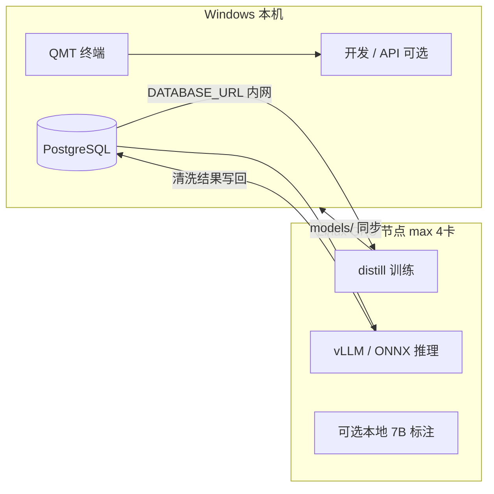
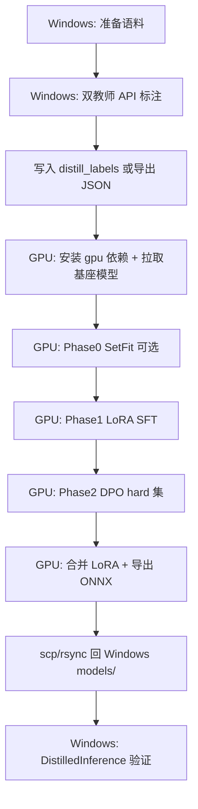
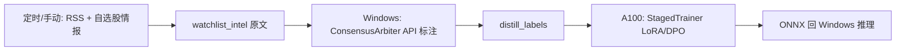

# A100 GPU 资源应用待办

> 最后更新: 2026-06-03（追加第十章操作步骤、第十一章采集/清洗对照）
>
> 本文档记录 **8× NVIDIA A100-SXM4-80GB**（CUDA 13.0）在 qt-quant 项目中的落地规划。
> 部署前提：**PostgreSQL + QMT 在 Windows 本机**；GPU 服务器为独立 Linux；qt 项目最多占用 **4 卡 / ~320GB 显存**，其余留给其他应用。
>
> 相关文档: [15-硬件配置指南](15-硬件配置指南.md) | [TODO-P2 知识蒸馏 P2-19~21](TODO-P2.md) | [13-数据清洗与LLM](13-数据清洗与LLM.md) | 返回 [TODO.md](TODO.md)

---

## 一、模块与 A100 适配一览

按「是否值得上 A100」与「建议卡数」分类。星级为 GPU 收益（非业务优先级）。

### 1.1 强烈推荐上 A100（核心 GPU 价值）

| 模块 | 路径 | GPU 收益 | 建议卡数 | 典型任务 | 状态 |
|------|------|---------|---------|---------|------|
| **知识蒸馏训练** | `src/distill/trainer.py` | ★★★★★ | **1 卡** | SetFit 冷启动、LoRA SFT、DPO；bf16 + 大 batch | 已有代码，待 A100 调参 |
| **蒸馏推理（批量）** | `src/distill/inference.py` | ★★★★ | **0~1 卡** | ONNX Runtime GPU、大批量情绪分类 | 已有 ONNX CPU 路径 |
| **数据清洗（蒸馏路径）** | `src/dataclean/cleaners/` | ★★★★ | **1 卡** | `distilled_cleaner` 批量清洗写回 DB | **待实现**（见 P2-21） |
| **Qwen3 本地抽取** | `src/dataclean/`（规划） | ★★★★ | **1 卡** | vLLM 高吞吐 JSON 抽取，替代部分 API | **待实现** `local_extractor` |
| **多教师共识标注（可选本地教师）** | `src/distill/consensus.py` | ★★★ | **1~2 卡** | 本地 7B 推理替代部分 DeepSeek/Qwen API | 当前为 HTTP API |

### 1.2 适合上 A100，但为可选增强

| 模块 | 路径 | GPU 收益 | 建议卡数 | 说明 |
|------|------|---------|---------|------|
| **LLM 因子挖掘** | `src/factor/llm_mining/`（P2-23 规划） | ★★★ | **1~2 卡** | FactorEngine 类任务，LLM 引导因子代码生成与回测 |
| **XGBoost / CatBoost** | `src/ml/`（扩展） | ★★ | **1 卡** | GPU 训练约 5× CPU；当前主路径为 LightGBM，非必需 |
| **TensorRT 加速** | `src/distill/` 导出链 | ★★ | **共享 1 卡** | ONNX → TensorRT，NVIDIA 推理优化（可选） |

### 1.3 不建议上 A100（留在 Windows CPU）

| 模块 | 路径 | 原因 |
|------|------|------|
| **LightGBM 因子模型** | `src/ml/lgb_model.py` | 树模型 CPU 多线程已足够；A100 几乎无加速 |
| **因子计算 Alpha158** | `src/factor/` | pandas 向量化，吃 CPU/内存，不吃 GPU |
| **回测引擎** | `src/backtest/` | 纯 CPU 逻辑 |
| **数据采集** | `src/datacollect/`、`src/data/` | 网络 I/O 为主 |
| **情绪引擎（非蒸馏路径）** | `src/sentiment/` | 量价/规则为主；LLM 部分可走 GPU 清洗子模块 |
| **组合优化 / ETF 轮动** | `src/portfolio/`、`src/strategy/etf_rotation/` | cvxpy / 小规模计算 |
| **FastAPI / 调度** | `src/api/` | 轻量服务，可留 Windows；推理可调 GPU 机 HTTP |
| **QMT 交易** | `src/trading/` | **必须 Windows**，无法迁到 Linux GPU 机 |

### 1.4 探索项（仅在明确需求时占用 2~4 卡）

| 场景 | 建议卡数 | 说明 |
|------|---------|------|
| 本地 **7B** 教师标注 | 1~2 卡 | QLoRA/推理约 14~20GB/卡，替代部分 API 成本 |
| **13B~30B** LoRA | 2~4 卡 | 需 DeepSpeed/FSDP，与当前单卡 `StagedTrainer` 不同 |
| **70B+** 训练/推理 | 不推荐 | 与「API 教师 + 小模型学生」战略不符，除非单独立项 |
| **8 卡 DDP 训 125M/600M 学生模型** | 禁止默认 | 通信开销大于收益 |

---

## 二、现状与结论

| 维度 | 现状 |
|------|------|
| 硬件 | 8× NVIDIA A100-SXM4-80GB，CUDA 13.0，Driver 580.x |
| 资源配额 | qt 项目 **最多 4 卡 / ~320GB**，卡 4~7 留给其他应用 |
| 数据与交易 | **PostgreSQL + QMT 在 Windows 本机**；GPU 机为附属计算节点 |
| 项目核心 ML | `src/ml/lgb_model.py`（LightGBM）— **CPU 为主** |
| GPU 真正价值 | `src/distill/`（LoRA 125M~600M）、本地推理/vLLM、可选 7B 教师与 FactorEngine |
| 设计 vs 实现 | [15-硬件配置指南](15-硬件配置指南.md) 第九章 `device_config.py`、vLLM、`distilled_cleaner.py` **仅有文档**；[pyproject.toml](../pyproject.toml) 主依赖 **无 torch/onnxruntime-gpu** |

**核心判断**：不要把整套 qt 迁到 GPU 机；在 320GB 上限内，GPU 机承担 **可调度批处理 + 可选常驻推理**，Windows 负责数据、交易与日常开发。



---

## 三、资源切分（320GB 上限）

| 用途 | 建议 GPU | 显存（量级） | 说明 |
|------|----------|-------------|------|
| FinBERT2 LoRA + DPO | **卡 0** | 4~8 GB | `trainer.py` 可改 bf16 + batch 64~128 |
| Qwen3-0.6B LoRA | **卡 0 或 1** | 6~12 GB | 与 FinBERT2 可分卡并行 |
| vLLM 生产推理（Qwen3） | **卡 1** | ~24 GB（`gpu_memory_utilization=0.3`） | A100 profile，见 doc/15 |
| FinBERT2 ONNX-GPU 批量清洗 | **卡 2** | 2~4 GB | batch 256 级 |
| 并行实验 / FactorEngine 预留 | **卡 3** | 余量 | 超参并行或多路队列 |

**环境隔离**（给其他应用留卡 4~7）：

```bash
export CUDA_VISIBLE_DEVICES=0,1,2,3
# 容器: docker run --gpus '"device=0,1,2,3"' ...
```

建议 GPU 机用 **systemd / cron + 任务脚本** 显式设置 `CUDA_VISIBLE_DEVICES`，避免与其他服务抢卡。

---

## 四、分阶段落地（按 ROI）

### A100-01：GPU 训练节点（预估 1~2 天）

**目标**：Windows 准备数据与标注；Linux 只跑 `StagedTrainer` + 数据集训练。

| 步骤 | 内容 |
|------|------|
| 环境 | Python 3.10+，`uv sync` + `gpu` 可选依赖；PyTorch 与 CUDA 13 对齐（见 [TODO-P2](TODO-P2.md) 选型表） |
| 数据库 | `DATABASE_URL` 指向 Windows 本机 PostgreSQL（内网 IP + 防火墙 5432） |
| 代码 | `trainer.py`：`fp16` → A100 上 **`bf16`**；`per_device_train_batch_size` 16 → **64~128**；读取 `CUDA_VISIBLE_DEVICES` |
| 教师 | `consensus.py` 仍可用 API 标注，训练阶段无需多卡 |
| 产物 | `models/distilled/` → rsync/scp 回 Windows；`DistilledInference` 可继续 CPU ONNX |

**预期**：LoRA 1~3h 级任务缩短到数十分钟；**仅用 1 卡**。

---

### A100-02：硬件适配层（预估 2~3 天）

实现 [15-硬件配置指南](15-硬件配置指南.md) 第九章：

| 文件 | 动作 |
|------|------|
| 新增 `src/common/device_config.py` | `DeviceProfile`、`PROFILES["a100"]`、`detect_gpu()`、`get_device_profile()` |
| 新增 `src/dataclean/cleaners/distilled_cleaner.py` | ONNX GPU batch + profile 驱动 batch size |
| 可选 `src/dataclean/cleaners/local_extractor.py` | A100 上 vLLM 后端 |
| `env/.env.example` | `DEVICE_PROFILE`、`CUDA_VISIBLE_DEVICES`、`QWEN3_GPU_MEM_UTIL` |
| `pyproject.toml` | `[project.optional-dependencies] gpu = [...]` |

探测：GPU 名含 `a100` 且约 80GB 显存 → 自动 `profile=a100`（batch 256 / vLLM）。

---

### A100-03：7×24 推理与 API 降本（按需，预估 3~5 天）

**目标**：本地模型减少 `src/dataclean/` 的 LLM API 调用。

- GPU 机：**1 卡 vLLM + 1 卡 ONNX** 常驻，或定时批处理写回 `clean_log`
- Windows FastAPI 通过 `GPU_INFER_URL` 调用 GPU 推理端点
- 320GB 内可 **4 路并行清洗队列**（每路 1 卡）
- 降级链：`DistilledInference` — 本地 ONNX → API → 规则

---

### A100-04：大模型与 FactorEngine（探索，非必须）

| 场景 | 卡数 | 说明 |
|------|------|------|
| 本地 7B 教师 | 1~2 | 替代部分 API 标注 |
| 13B~30B LoRA | 2~4 | DeepSpeed/FSDP，新训练管线 |
| 70B+ | — | 非 qt 默认路径 |
| 8 卡 DDP 小模型 | — | **不建议** |

关联 TODO：[P2-19~21 知识蒸馏](TODO-P2.md)、[P2-23 LLM 因子挖掘](TODO-P2.md)。

---

## 五、推荐环境变量

**GPU 机 `.env` 片段**：

```bash
CUDA_VISIBLE_DEVICES=0,1,2,3
DEVICE_PROFILE=a100
DATABASE_URL=postgresql://user:pass@<windows-lan-ip>:5432/qt_quant
# 卡0: distill 训练（按需）
# 卡1: vLLM Qwen3 推理
# 卡2: FinBERT2 ONNX-GPU 批处理
# 卡3: 并行实验 / 预留
QWEN3_GPU_MEM_UTIL=0.25
```

**Windows `.env`**：保持 `DATABASE_URL`、`QMT_*`；阶段 3 增加 `GPU_INFER_URL=http://<gpu-server>:8xxx`。

---

## 六、风险与兼容

| 风险 | 对策 |
|------|------|
| CUDA 13 与 wheel 版本 | `torch` / `onnxruntime-gpu` 与驱动匹配；CI 无 GPU，保持延迟 import |
| 跨机 PostgreSQL | Windows 防火墙放行；内网低延迟 |
| 模型文件 | HF 镜像或预下载到 `models/` |
| Docker 无 GPU | 需 `nvidia-container-toolkit`；或裸机 `uv run` |

---

## 七、实施待办清单

| ID | 任务 | 模块 | 预估 | 状态 |
|----|------|------|------|------|
| A100-01 | GPU 机 4 卡限额 + 连 Windows PG + 跑通 distill LoRA | `distill` | 1~2 天 | 待做 |
| A100-02 | 实现 `device_config.py` + `gpu` optional deps + `.env` | `common` / `dataclean` | 2~3 天 | 待做 |
| A100-03 | vLLM/ONNX 推理服务 + `GPU_INFER_URL` 对接 | `dataclean` / `api` | 3~5 天 | 按需 |
| A100-04 | 本地 7B 教师 / FactorEngine | `distill` / `factor` | 探索 | 按需 |
| A100-05 | 蒸馏语料管线（采集落库 + 共识标注 → `distill_labels`） | `datacollect` / `distill` | 2~3 天 | 待做 |

**PR 建议**：A100-05 宜在 A100-01 训练脚本之前或同期完成（无标注数据则 GPU 无料可训）；A100-01 + A100-02 合并为一个 PR；A100-03 单独 PR。

---

## 八、实施优先级小结

1. **立刻**：4 卡限额 + Windows PG + distill LoRA（bf16 / 大 batch）
2. **短期**：`device_config.py` + gpu 依赖 + `.env` 模板
3. **中期**：vLLM/ONNX 推理降 API 成本（1~2 卡常驻）
4. **长期/可选**：本地 7B 教师、FactorEngine（仍在 320GB 内）

---

## 九、与 doc/15 A100 Profile 对照

| 参数 | doc/15 `a100` profile | 本部署默认 |
|------|----------------------|-----------|
| 精度 | bf16 | bf16 |
| FinBERT2 batch | 256 | 卡 2 批处理 |
| Qwen3 后端 | vLLM | 卡 1 |
| 并行模型数 | 4 | 4 卡各担一路 |
| 改代码？ | 配置驱动 | 先补 `device_config.py` |

详见 [15-硬件配置指南 — 第九章](15-硬件配置指南.md)。

---

## 十、A100 部署后：知识蒸馏训练操作步骤

本章说明 **按本文档完成 A100-01 环境部署后**，从原始文本到可上线 ONNX 模型的完整手工流程。  
当前仓库已有 `src/distill/` 核心类，**尚无** `scripts/run_distill_train.py` 一键脚本；下列命令以 `uv run python` 调用模块为主，实施 A100-01 时可把第十章示例固化为正式脚本。

> **数据从哪来？** 采集/清洗系统**尚未**自动产出蒸馏训练集，见 [第十一章](#十一采集清洗系统与蒸馏训练数据对照) 与待办 **A100-05**。

### 10.0 流程总览



| 阶段 | 执行位置 | 主要组件 | 耗时（参考） |
|------|----------|----------|-------------|
| 标注 | **Windows**（或任意能访问 API 的机器） | `ConsensusArbiter` + DeepSeek/Qwen API | 取决于条数 |
| 训练 | **Linux A100**（`CUDA_VISIBLE_DEVICES=0` 单卡即可） | `StagedTrainer` | SetFit ~30s；LoRA 数十分钟~1h；DPO ~0.5h |
| 导出 / 验证 | GPU 或 Windows | `optimum` ONNX、`DistilledInference` | 10~30 分钟 |

---

### 10.1 一次性准备（两台机器）

#### 10.1.1 Windows 本机

1. PostgreSQL 已建库并执行过 `uv run python scripts/init_db.py`（会注册 `distill_labels`、`flywheel_queue` 等表，见 `src/distill/models.py`）。
2. `.env` 中配置 LLM（标注用，**在 Windows 跑即可**，不占 A100）：

```bash
LLM_PROVIDER=deepseek
DEEPSEEK_API_KEY=<你的密钥>
DEEPSEEK_BASE_URL=https://api.deepseek.com
QWEN_API_KEY=<你的密钥>
QWEN_BASE_URL=https://dashscope.aliyuncs.com/compatible-mode/v1
```

3. 准备待标注语料（任选其一）：
   - 从 `clean_log` / 新闻采集表导出 `text` 字段；
   - 或自建 `data/distill/raw_texts.txt`（每行一条）。

4. 防火墙：**允许 GPU 服务器内网 IP 访问 TCP 5432**（若训练脚本要从 GPU 机读 `distill_labels`）。

#### 10.1.2 Linux GPU 机（A100）

```bash
# 1) 克隆/同步代码（与 Windows 同分支）
git clone <repo> qt && cd qt

# 2) 限制 qt 只用 0~3 号卡（训练默认单卡，见 0 号）
export CUDA_VISIBLE_DEVICES=0,1,2,3

# 3) 基础依赖 + GPU 训练依赖（A100-02 落地前可先手动安装）
uv sync
uv pip install torch torchvision --index-url https://download.pytorch.org/whl/cu124
uv pip install transformers peft trl setfit datasets accelerate scipy
uv pip install optimum onnxruntime onnxruntime-gpu

# 4) 验证 GPU
nvidia-smi
uv run python -c "import torch; print(torch.cuda.get_device_name(0), torch.cuda.is_available())"

# 5) 连接 Windows 数据库（示例）
export DATABASE_URL=postgresql://<user>:<pass>@<windows-lan-ip>:5432/qt_quant

# 6) 基座模型（FinBERT2 情绪分类，按 P2-20 默认学生）
# 国内建议先设镜像再下载
export HF_ENDPOINT=https://hf-mirror.com
mkdir -p models/finbert2-base
# 将 STUDENT_MODEL 指向 HF 或本地目录，见 10.3
export STUDENT_MODEL=valuesimplex/FinBERT2-base
```

> **说明**：`pyproject.toml` 的 `[optional-dependencies] gpu` 在 A100-02 完成前，需用上面 `uv pip install` 手动装齐训练包。

---

### 10.2 步骤一：双教师共识标注（Windows）

标注走 API，**不必在 A100 上跑**，避免占用 GPU。

在项目根目录创建并运行（示例保存为 `scripts/run_distill_label.py`，也可在 `python` 交互里执行）：

```python
"""双教师标注 → 写入 distill_labels（在 Windows 执行）"""
import asyncio
from pathlib import Path

from src.common.config import settings
from src.common.db import get_session
from src.distill.consensus import ConsensusArbiter
from src.distill.models import DistillLabel
from src.dataclean.llm_client import LLMClient  # 见下方「标注前置条件」

async def main():
    texts = Path("data/distill/raw_texts.txt").read_text(encoding="utf-8").splitlines()
    texts = [t.strip() for t in texts if t.strip()][:500]  # 首批可限制条数试跑

    arbiter = ConsensusArbiter(llm_client=LLMClient(settings.dataclean))
    labels = await arbiter.label_batch(texts)
    easy, hard = arbiter.score_difficulty(labels)

    with get_session() as session:
        for lb in labels:
            session.add(DistillLabel(
                text=lb.text,
                teacher_a_label=lb.teacher_a_label,
                teacher_b_label=lb.teacher_b_label,
                consensus_label=lb.label,
                confidence=lb.confidence,
                is_hard=lb.is_hard,
                difficulty_score=lb.difficulty_score,
            ))
        session.commit()
    print(f"已写入 {len(labels)} 条, easy={len(easy)}, hard={len(hard)}")

if __name__ == "__main__":
    asyncio.run(main())
```

```bash
# Windows 项目根目录
uv run python scripts/run_distill_label.py
```

**标注前置条件**：`ConsensusArbiter._classify` 当前调用 `llm.aclassify()`，而 `LLMClient` 尚未实现该方法（P2-19 待补）。在此之前可：

- 临时在 `LLMClient` 上封装 `aclassify`（内部用 `extract` + 三分类 Schema）；或
- 接受 `llm=None` 时的**规则降级**（仅用于管线试跑，不适合正式训练）；或
- 手工维护 `data/distill/easy.jsonl` 跳过 API 标注，直接进 10.3。

**标签约定**（与 `StagedTrainer` 一致）：

| 共识标签 | 训练用 `label` 字段 | `num_labels` 下标 |
|----------|---------------------|-------------------|
| negative | `negative` 或 `0` | 0 |
| neutral | `neutral` 或 `1` | 1 |
| positive | `positive` 或 `2` | 2 |

也可不用数据库，直接导出 JSON（见 10.3.2）。

---

### 10.3 步骤二：在 A100 上训练学生模型

训练前 **只占用 1 张卡**（推荐物理卡 0）：

```bash
export CUDA_VISIBLE_DEVICES=0
export STUDENT_MODEL=valuesimplex/FinBERT2-base   # 或 models/finbert2-base 本地路径
cd /path/to/qt
```

#### 10.3.1 从 PostgreSQL 构建 HuggingFace Dataset（GPU 机）

```python
"""从 distill_labels 构建 easy / hard 数据集（在 GPU 机执行）"""
import os
from datasets import Dataset
from sqlalchemy import create_engine, text

LABEL2ID = {"negative": 0, "neutral": 1, "positive": 2}

engine = create_engine(os.environ["DATABASE_URL"])

with engine.connect() as conn:
    easy_rows = conn.execute(text(
        "SELECT text, consensus_label FROM distill_labels WHERE is_hard = FALSE"
    )).fetchall()
    hard_rows = conn.execute(text(
        "SELECT text, consensus_label, teacher_a_label, teacher_b_label "
        "FROM distill_labels WHERE is_hard = TRUE"
    )).fetchall()

easy_ds = Dataset.from_dict({
    "text": [r[0] for r in easy_rows],
    "label": [LABEL2ID.get(r[1], 1) for r in easy_rows],
})

# DPO 需要 chosen/rejected；hard 集用「共识 vs 某教师错误标签」构造偏好对
hard_ds = Dataset.from_dict({
    "prompt": [r[0] for r in hard_rows],
    "chosen": [r[1] for r in hard_rows],
    "rejected": [r[2] if r[2] != r[1] else r[3] for r in hard_rows],
})

print("easy", len(easy_ds), "hard", len(hard_ds))
```

保存为 `scripts/build_distill_dataset.py` 后：

```bash
uv run python scripts/build_distill_dataset.py
```

#### 10.3.2 或：从 JSON 文件训练（无跨机 DB 时）

在 Windows 导出：

```json
// data/distill/easy.jsonl  每行 {"text":"...", "label": 0|1|2}
// data/distill/hard.jsonl  每行 {"prompt":"...", "chosen":"positive", "rejected":"negative"}
```

拷到 GPU 机 `data/distill/`，训练脚本用 `datasets.load_dataset("json", data_files=...)` 加载。

#### 10.3.3 Phase 0：SetFit 冷启动（可选，8 条/类）

人工准备极少样本快速验证管线：

```python
from src.distill.trainer import StagedTrainer

few_shot = {
    "positive": ["公司净利润同比增长50%", "获机构增持评级"],
    "negative": ["业绩大幅下滑", "遭监管处罚"],
    "neutral": ["公司发布例行公告", "召开年度股东大会"],
}
trainer = StagedTrainer(student_name=os.environ["STUDENT_MODEL"])
model0 = trainer.phase0_setfit(few_shot)
# 可选: model0.save_pretrained("models/distilled/setfit-baseline")
```

#### 10.3.4 Phase 1：LoRA SFT（主训练，A100 核心步骤）

```python
import os
from src.distill.trainer import StagedTrainer
# easy_ds 来自 10.3.1 或 JSON

trainer = StagedTrainer(student_name=os.environ["STUDENT_MODEL"], lora_rank=16)
model = trainer.phase1_lora_sft(easy_ds)
model.save_pretrained("models/distilled/finbert2-lora-merged")
```

```bash
# 单命令示例（将 easy_ds 构建逻辑写入 scripts/run_distill_train.py 后）
export CUDA_VISIBLE_DEVICES=0
uv run python scripts/run_distill_train.py --phase 1 --student "$STUDENT_MODEL"
```

**A100 调优（A100-01 代码合并后生效；当前 `trainer.py` 仍为 fp16 + batch 16）**：

| 参数 | RTX 4090 默认 | A100 建议 |
|------|--------------|-----------|
| `per_device_train_batch_size` | 16 | **64~128** |
| 精度 | fp16 | **bf16** |
| 卡数 | 1 | **1**（不要 8 卡 DDP） |

合并前可在本机临时改 `TrainingArguments` 做首次训练。

#### 10.3.5 Phase 2：DPO（hard 集，可选但推荐）

```python
model = trainer.phase2_dpo(hard_ds, model)
model.save_pretrained("models/distilled/finbert2-dpo-merged")
```

hard 集过少（< 50 条）时可跳过 DPO，仅部署 Phase 1 产物。

---

### 10.4 步骤三：导出 ONNX（GPU 或 Windows）

训练产物为 PyTorch / PEFT 目录时，导出为生产用 ONNX：

```python
from optimum.onnxruntime import ORTModelForSequenceClassification
from transformers import AutoTokenizer

merged = "models/distilled/finbert2-lora-merged"
onnx_dir = "models/distilled/onnx"

model = ORTModelForSequenceClassification.from_pretrained(merged, export=True)
model.save_pretrained(onnx_dir)
tok = AutoTokenizer.from_pretrained(merged)
tok.save_pretrained(onnx_dir)
print("ONNX 已写入", onnx_dir)
```

```bash
uv run python -c "..."   # 或 scripts/export_distill_onnx.py
```

可选 INT8 量化见 [TODO-P2 P2-21](TODO-P2.md) 中 `ORTQuantizer` 示例；Windows 推理 CPU 更省资源。

---

### 10.5 步骤四：模型回传 Windows 并验证

```bash
# 在 GPU 机执行，将产物同步到 Windows（示例路径按你本机修改）
rsync -avz models/distilled/ dongg@<windows-ip>:/c/Users/dongg/git/qt/models/distilled/
# Windows PowerShell 也可用 scp:
# scp -r user@gpu-host:/path/to/qt/models/distilled ./models/
```

Windows `.env` 增加（与 `DistilledInference` 默认路径对齐）：

```bash
DISTILL_MODEL_PATH=models/distilled/onnx
```

验证：

```python
from src.distill.inference import DistilledInference
inf = DistilledInference(model_path="models/distilled/onnx")
print(inf.predict("央行宣布降准，市场流动性预期改善"))
print(inf.predict("某公司涉嫌财务造假被立案调查"))
```

或通过 dataclean 管线调用（`distilled_cleaner` 实现后接入 [13-数据清洗与LLM](13-数据清洗与LLM.md)）。

---

### 10.6 步骤五：数据飞轮（增量重训，可选）

生产推理后，低置信样本进入 `flywheel_queue`（见 `src/distill/flywheel.py`、`FlywheelQueue` 表）。每周迭代：

1. **Windows / 定时任务**：从 `flywheel_queue` 取 `processed=FALSE` 的 `text`；
2. **API 重标注**：`ConsensusArbiter.label_batch` → 追加 `distill_labels`；
3. **GPU 机**：仅跑 **Phase 1 增量 LoRA**（全量 easy 集或新旧合并），评估 F1 后决定是否替换 ONNX；
4. 标记 `flywheel_queue.processed=TRUE`。

```bash
# GPU 机增量训练（示例）
export CUDA_VISIBLE_DEVICES=0
uv run python scripts/run_distill_train.py --phase 1 --incremental
```

完整调度（APScheduler）见 P2-21，与 A100-03 推理服务一并落地。

---

### 10.7 命令速查表

| 目的 | 机器 | 命令 |
|------|------|------|
| 初始化 DB 表 | Windows | `uv run python scripts/init_db.py` |
| 双教师标注 | Windows | `uv run python scripts/run_distill_label.py` |
| 构建 Dataset | GPU | `uv run python scripts/build_distill_dataset.py` |
| LoRA 训练 | GPU | `CUDA_VISIBLE_DEVICES=0 uv run python scripts/run_distill_train.py --phase 1` |
| DPO | GPU | `CUDA_VISIBLE_DEVICES=0 uv run python scripts/run_distill_train.py --phase 2` |
| 导出 ONNX | GPU / Win | `uv run python scripts/export_distill_onnx.py` |
| 同步模型 | GPU → Win | `rsync -avz models/distilled/ ...` |
| 冒烟推理 | Windows | `uv run python -c "from src.distill.inference import ..."` |

带 *斜体* 的脚本为 **A100-01 建议新增**，当前需按 10.3~10.4 内联 Python 执行。

---

### 10.8 常见问题

| 现象 | 处理 |
|------|------|
| `RuntimeError: peft/transformers 未安装` | GPU 机执行 `uv pip install peft transformers trl setfit datasets` |
| `CUDA out of memory` | 确认 `CUDA_VISIBLE_DEVICES=0` 单卡；减小 batch；勿同时开 vLLM |
| GPU 机连不上 Windows PG | 检查防火墙、`pg_hba.conf` 是否允许 GPU 机 IP |
| 标签全是 `neutral` | 检查 API Key、`ConsensusArbiter` 是否降级到规则 |
| LoRA 很快结束但效果差 | easy 集太小；增加标注量或先做 Phase 0 SetFit |
| Windows 推理慢 | 正常；生产可用 ONNX CPU；高 QPS 再走 A100-03 GPU 批推理 |

---

### 10.9 与实施待办的对应关系

| 操作步骤 | 依赖待办 |
|----------|----------|
| 10.1~10.5 跑通首次蒸馏 | **A100-01**（GPU 依赖、bf16/batch、`run_distill_train.py`） |
| 自动 profile / vLLM 推理 | **A100-02**、`device_config.py` |
| 飞轮 + 常驻推理 | **A100-03** |
| 本地 7B 教师替代 API 标注 | **A100-04** |

---

## 十一、采集/清洗系统与蒸馏训练数据对照

> 回答：现有 `datacollect` / `dataclean` **是否已采集**蒸馏所需的「原文 + 三分类标签」？  
> 结论：**采集器具备采新闻能力，但未对准蒸馏；清洗产出的是情绪引擎 Schema，不是 `distill_labels`。**

### 11.1 蒸馏训练需要什么

| 字段 | 说明 |
|------|------|
| `text` | 单条新闻/公告原文 |
| `consensus_label` | `positive` / `negative` / `neutral`（或 0/1/2） |
| `is_hard`（可选） | 双教师分歧样本，供 DPO |

文档第十章 Phase 0 的 `few_shot` 仅为**管线试跑示例**，仓库内**无**预置 `data/distill/` 语料文件。

### 11.2 采集层（`src/datacollect/`）

| 能力 | 代码状态 | 是否自动调度 | 能否直接用于蒸馏 |
|------|----------|-------------|------------------|
| 财经 RSS（标题+摘要） | ✅ `NewsRssCollector` | ❌ scheduler/API 未接 `financial_news` 落库 | 仅有组件；需脚本触发并映射到 `watchlist_intel`（见 [13-数据清洗与LLM](13-数据清洗与LLM.md) 对接规范） |
| 自选股新闻/公告 | ✅ `WatchlistIntelCollector` → `watchlist_intel` | ❌ 生产仅测试调用 `collect_and_save` | ✅ **原文**可导出；❌ **无三分类标签** |
| 全球市场快照 | ✅ yfinance / sina → `global_market_snapshot` | 部分经 `SentimentBridge` | ❌ 数值指标，非句子级语料 |
| `/api/sentiment/ingest` | ✅ | 手动/定时 | ❌ 仅 Layer 1 **量价**（`stock_daily`），不采新闻 |
| `/api/sentiment/ingest/external` | ✅ | OpenClaw 推送 | ❌ 市场级数值/事件，非逐条标注 |
| `distill_labels` 专用采集 | ❌ | — | ❌ |

### 11.3 清洗层（`src/dataclean/`）

| 能力 | 代码状态 | 产出格式 | 能否直接用于蒸馏 |
|------|----------|----------|------------------|
| `SentimentCleaner` | ✅ | `SentimentExtraction`（整体 `news_sentiment_score`、`key_events[].impact`） | ❌ 非「每条 text 一个三分类」 |
| `rule_cleaner` / `passthrough_cleaner` | ✅ | 规则或直通 | ❌ |
| `distilled_cleaner` | ❌（P2-21 设计） | 本地 ONNX 推理 | 推理阶段用，不是训练标注 |
| `StockEventCleaner` 等 | Schema 在 `registry.py` | **无** `cleaners/*.py` 实现 | ❌ |
| `clean_log` 持久化 | 表已定义 | 设计为记录 LLM 调用 | ❌ **业务代码未写入**；且仅 500 字预览 |
| 双教师 → `distill_labels` | `src/distill/consensus.py` | 共识三分类 | ❌ **未与采集/清洗调度串联**；`LLMClient.aclassify` 待补（见 10.2） |

`SentimentCleaner` 当前主要在 **测试**与[用户手册](08-用户手册.md)示例中使用，**没有**「读 `watchlist_intel` → 清洗 → 写训练表」的生产任务。

### 11.4 设计目标 vs 当前流水线

**文档目标**（[13-数据清洗与LLM](13-数据清洗与LLM.md)）：

```text
NewsRss / WatchlistIntel → watchlist_intel → SentimentCleaner → 情绪/雷达分析
```

**当前实际**：

```text
采集器（单元测试可用） ──?──> watchlist_intel（需手动/脚本触发）
                              ↓
                         SentimentCleaner（需手动调；输出 ≠ 蒸馏标签）
                              ↓
                         distill_labels（无自动写入）
```

情绪引擎线上路径：`/api/sentiment/ingest`（量价）、`ingest/external`（外部数值）、`SentimentBridge`（全球行情）→ `sentiment_daily`，**均不是** SetFit/LoRA 语料库。

### 11.5 总览：能否直接训练？

| 数据类型 | 采集 | 清洗 | 直接训练蒸馏 |
|----------|------|------|-------------|
| 新闻标题/摘要（RSS） | 组件有，流水线未接 | 未批量跑 | ❌ |
| 自选股新闻/公告 | 组件有，需触发 | 未批量跑 | ❌（仅有原文时可再标注） |
| 市场情绪数值 | ✅ | 部分结构化 | ❌ |
| `few_shot` 示例句 | ❌ | ❌ | ❌ |
| `distill_labels` | ❌ | ❌ | ❌ |

### 11.6 库内自检 SQL（Windows PostgreSQL）

```sql
SELECT COUNT(*) AS watchlist_news FROM watchlist_intel WHERE intel_type = 'news';
SELECT COUNT(*) AS ingest_logs FROM sentiment_ingest_log;
SELECT COUNT(*) AS distill_rows FROM distill_labels;
SELECT COUNT(*) AS flywheel_rows FROM flywheel_queue;
```

| 结果 | 含义 |
|------|------|
| `watchlist_intel` > 0 | 有**未标注原文**，需走第十章 **10.2** 共识标注 |
| 全表为 0 | 先触发 `WatchlistIntelCollector` / RSS 入库，再标注 |
| `distill_labels` > 0 | 可直接 **10.3** 在 A100 上训练 |

### 11.7 建议补全的管线（新增待办）

在现有采集/清洗之上，蒸馏需要**单独一条任务链**（与 A100-01 训练节点配合）：



| ID | 任务 | 说明 |
|----|------|------|
| **A100-05** | 蒸馏语料管线对接 | ① scheduler 或脚本：`NewsRss`/`WatchlistIntel` 落库；② `LLMClient.aclassify` + `run_distill_label.py`；③ 可选从 `SentimentExtraction.key_events` **不能**替代逐条三分类，勿混用 |

关联：[TODO-P2 P2-19~21](TODO-P2.md)、[12-数据采集模块](12-数据采集模块.md)、[13-数据清洗与LLM](13-数据清洗与LLM.md)。
