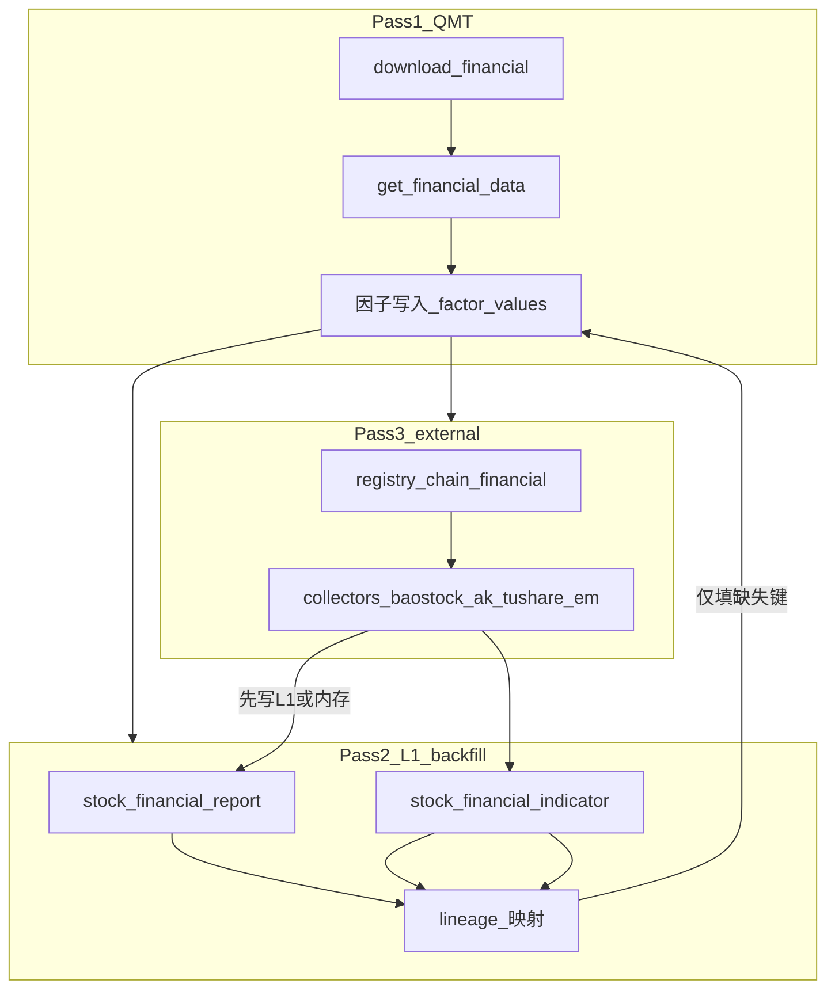

# 多源财务/因子补全 — 详细设计

> 状态：TODO / 设计稿  
> 关联计划：`.cursor/plans/多源财务补全方案_978ea414.plan.md`  
> 目标读者：实现采集/因子与数据工程的开发者

## 1. 背景与问题

### 1.1 当前行为

- **主路**（`src/data/factor_data.py` 中 `sync_factors`）：仅使用迅投 QMT：先 `download_financial`（内部 `download_financial_data2` 等）再 `get_financial_data`，将 `FACTOR_CATALOG` 中带有合法 `qmt_field`（`表名.列名`）的因子写入 `factor_values`（长表：`trade_date`, `code`, `factor_id`, `value`）。
- **缺口**：若返回 DataFrame 中无对应列，当前仅打 **debug** 日志并跳过，**无第二数据源** 回填。
- **注册与降级链**（`src/datacollect/data_sources.json`）：`fallback_chains.financial` 已配置  
  `["xtquant", "baostock", "akshare", "tushare", "eastmoney"]`，但 **未被** `sync_factors` 消费。
- **旁路表**：`akshare_financial_sync` 等路径可向 `stock_financial_report` / `stock_financial_indicator` 写入**财务摘要/指标**（L1 域表），与 `factor_values` **无自动合并**。

### 1.2 要解决的问题

1. 在 **不破坏现有多源采集架构** 的前提下，让「因子/财务长表」能 **按优先级** 从 QMT、已有 L1 表、外源采集器补全。  
2. 避免将 **未规范化的 raw 行** 直接塞入 `factor_values`（单位、报告期、公告日口径混用会导致回测与对账不可信）。  
3. 使「补全」**可观测**：按因子/按源覆盖率、缺列原因、最后成功源。

## 2. 设计目标与非目标

### 2.1 目标

- **G1** — **分层存储**：L1 域表（宽表/固定列）+ L2 特征长表（`factor_values`），补全经 **显式映射** 写入 L2。  
- **G2** — **三阶段管线**：主源 QMT 写入 → 从 L1 仅填缺口 → 再按 `financial` 降级链对仍缺项调外源（只拉缺口，控制配额）。  
- **G3** — **配置驱动血缘**：`factor_name` 到多源场地的映射与 asof 规则可版本化、可 review。  
- **G4** — **可度量**：因子级 coverage、按源统计、缺列/批失败可汇总到日志或进度表。

### 2.2 非目标（本设计阶段不承诺）

- 为 **所有** QMT 注册字段自动找到 1:1 的 Tushare/AkShare 列（需逐字段人工/半自动校验）。  
- 在本文档中固定 **QMT 与 Tushare 的会计口径差异** 的数学修正（仅要求「可标注 only_qmt / unmapped」）。  
- 替代现有 **另类日频**（`alt_source_cascade`）的按日 for-loop 语义；财务补全为 **按批次/按表/按缺口集合** 调度。

## 3. 概念模型与分层

### 3.1 数据分层

| 层级 | 代表 | 职责 |
|------|------|------|
| L0 可选 | `stock_financial_raw` 或源站 JSONB | 审计、重放、纠纷排查；不直接参与回测取数主路径。 |
| L1 域 | `stock_financial_report`, `stock_financial_indicator` | 财务科目/指标宽表，列语义稳定，适合多源 **汇聚后再映射**。 |
| L2 特征 | `factor_values` + `factor_meta` | 回测/因子工程使用的长表；值应对齐统一 **asof 与频率** 约定。 |

### 3.2 与现有 `financial` 降级链的关系

- `DataSourceRegistry.get_fallback_chain("financial")`（`src/datacollect/registry.py` + `data_sources.json`）定义 **外源尝试顺序**；新实现应 **读配置**，避免在业务代码中硬编码优先级。  
- 另类日频中的 `run_source_stack` / `CascadeStrikeState`（`src/data/alt_source_cascade.py`）提供 **每源限时、重试、连续无效停用** 的思想；财务 Pass 3 可复用其 **控制面**，但 **数据面** 是「写 L1 或临时 DataFrame → 再映射到 L2」，不是「按自然日换源」。



## 4. 字段血缘与 asof 规则

### 4.1 `field_lineage` 建议形态

二选一（实现时定稿其一）：

**方案 A — `factor_meta` 扩展列（JSONB `field_lineage`）**

- 与因子版本约束天然一致。  
- 大表 `ALTER` 与 ORM 迁移需一次迁移脚本。

**方案 B — 旁路表 `factor_field_map`**

- 列：`factor_name`, `version`, `primary_ref`, `fill_refs`（jsonb）, `asof_key`, `updated_at`）。  
- 易批量导入/对比，不撑胖 `factor_meta` 行。

**`fill_refs` 元素示例**（示意，非最终字段名）：

```json
{
  "primary": { "kind": "qmt", "ref": "Balance.tot_assets" },
  "fill": [
    { "kind": "column", "table": "stock_financial_report", "column": "total_assets", "asof": "report_date" },
    { "kind": "tushare", "api": "fina_indicator", "field": "total_assets" }
  ]
}
```

- `kind: column` 表示**本库 L1 列**；`kind: tushare` 等表示 **Pass3 经 Collector 拉取后写入 L1 再映射**（或直接内存 join，但建议统一落 L1 以便对账）。  
- 对无法映射的因子：`fill: []` 且元数据 `storage_hint=only_qmt` 或 `unmapped: true`，避免假「全源补全」。

### 4.2 日期对齐（asof）— 须项目级唯一约定

**冲突来源**：

- QMT `get_financial_data` 在现有代码中使用 `report_type="announce_time"`，索引到「公告/可用日期」维度的时序。  
- L1 表使用 `report_date`、`report_period`（如 `20240331`）。  

**推荐（实现时二选一，并在代码与文档中写死）**：

1. **以公告日为 `factor_values.trade_date`**：与 QMT 主路一致，L1 补全时取 `stock_financial_*.report_date` 与因子行对齐。  
2. **以报告期末为键**：则 QMT 与 L1 都需重采样到「期末日」— 与当前 `sync_factors` 行为可能不一致，**改动面大**，仅当产品明确要求时采用。  

**默认建议**：**pass1 保持现有 QMT 语义**；**pass2 的 L1 映射** 使用 `report_date`（或经确认的等价列）与 `factor_values` 的 `(code, trade_date)` 在血缘中显式说明 join 键。

## 5. 三阶段管线（详细步骤）

### 5.1 Pass 1 — QMT 主写入（与现网一致）

- 根据 `FACTOR_CATALOG` 中有 `qmt_field` 且含 `.` 的项构建 `table_list`，`DownloadEngine.download_financial` + `get_financial_data`。  
- 将能解析的列展开为 `factor_values` 行（现有逻辑）。  
- **改进点（设计级）**：对「列不存在」从纯 debug 改为 **结构化计数**（如内存 Counter 或写 `financial_sync_run` 统计表），供 coverage 与告警使用。

### 5.2 Pass 2 — L1 内表回填（不重复出网）

**输入**：本次任务的股票集合 `S`、日期窗、以及 Pass1 之后仍未满足的 `(code, trade_date, factor_id)` 集合（或「允许覆盖 NULL」策略下的缺口）。  
**逻辑**：

- 对 `field_lineage.fill` 中 `kind: column` 的项，用 SQL 将 L1 列 join 到目标因子；**INSERT ... ON CONFLICT DO UPDATE** 时带条件，例如 `WHERE factor_values.value IS NULL` 或 `WHERE excluded.source_priority < new.priority`（若引入来源优先级）。  
- **只补映射已审核的因子**，避免错误拼接。

### 5.3 Pass 3 — 外源按链补全

**输入**：仍缺的 `(factor_name, code, 时间范围)` 列表（可批量按因子拆任务）。  
**流程**：

1. `chain = registry.get_fallback_chain("financial")`，跳过 `xtquant` 若已在 Pass1 处理完毕则不从链上重复全量拉财务（或仅对缺口 code 再调 QMT 子集 — 需配置）。  
2. 对每个 `source_name`：实例化或调用 `collector` 中「财务类」能力（与现有 `capabilities: financial` 对齐），将结果写入 L1 或 **临时表**，记录 `source` 与 `fetched_at`。  
3. 复用与 Pass2 相同的 **lineage 映射** 进入 `factor_values`。  
4. 使用与 `alt_source_cascade` 类似的 **per_source 超时、重试、连续 0 行/全失败则本任务停用该源**（参数名可与 `DATACOLLECT_SOURCE_*` 对齐，避免又一套魔法数）。  

**重要**：Pass3 **仅应对缺口** 发请求，以节约 Tushare 积分与东财限流。

## 6. 溯源与表结构

### 6.1 `factor_values` 溯源

**问题**：当前行无 **写入来源** 字段，无法做「QMT 主写 vs L1 补 vs 外源补」质量分析。

**选项**：

- **6.1a** 在 `factor_values` 增加可空列：`value_source`（`qmt` | `l1_backfill` | `baostock` | …）、`ingested_at`。  
- **6.1b** 旁路表 `factor_value_ingest`：`(trade_date, code, factor_id, source, batch_id, created_at)`，与长表 1:1 或 多版本，用于审计。  

**Upsert 策略**：

- 若仅「填 NULL」：后写来源不得覆盖非 NULL 的 QMT 主值（除非配置 `force_override` 用于修数）。  
- 若多源同时有值：用 **`source_priority` 在血缘或全局配置** 决定胜者，并写入 `value_source`。

### 6.2 L0 Raw（可选）

`stock_financial_raw(code, source, report_period, payload JSONB, fetched_at, UNIQUE 约束视业务定)`：  
- 不替代 L1；  
- 供合规、对账、回归测试重放。  

## 7. 可观测性与质量闸门

- **每作业汇总**：`factors_total_rows_written`、`by_source`、`missing_column_counts`（按 `表.列`）、`pass2_rows`、`pass3_rows`、**失败批次数**（与 `download_engine` 批失败对接）。  
- **因子级 coverage**：`filled / expected`（expected 由股票列表 × 时间窗 × 有权限因子定义决定）。  
- **告警条件示例**：某核心因子 coverage &lt; 阈值；某源连续 N 次 0 行；Pass3 全链失败。  

与现有 `alt_datacollect_progress` 等表 **可同构扩展** 一类 `financial_backfill_run`，避免各处自定义日志格式。

## 8. 与统一采集入口的衔接

- `unified_collect` / 定时任务应 **先保证 L1 财务任务**（若依赖 AkShare 路径）在 Pass2 之前有足够数据，或 **显式声明顺序**：`sync_financial_l1` → `sync_factors`（含 Pass1–3）。  
- 配置项（建议，名称待与 `DatacollectConfig` 统一）：  
  - `FINANCIAL_BACKFILL_ENABLE`  
  - `FINANCIAL_BACKFILL_PASS2_ENABLE` / `PASS3_ENABLE`  
  - `FINANCIAL_BACKFILL_ONLY_NULL`（默认 true）  

## 9. 风险与缓解

| 风险 | 缓解 |
|------|------|
| 跨源口径不一致 | 血缘表标注 `only_qmt`；差异大的因子不自动补；文档与单元测试用固定样例股对比。 |
| 配额/封 IP | Pass3 仅缺口；级联停用坏源；与 `rate_limiter`、registry `rate` 一致。 |
| 日期错配导致重复或错位 | 单一 asof 策略；迁移与一次性校验脚本。 |
| 性能 | Pass2 批量 SQL；Pass3 按 code 分片并发受 `max_concurrent` 约束。 |

## 10. 测试与验收

- **单元测试**：lineage 解析、asof join、仅 NULL 的 upsert、source 优先级。  
- **集成测试**：Mock collector 返回固定 DataFrame，验证三阶段顺序与 `value_source`。  
- **E2E**（需 MiniQMT/券商环境时与现有 E2E  policy 一致）：样本股跑通 Pass1+Pass2。  

## 11. 落地任务清单（与计划 TODO 对应）

1. **lineage-spec**：定稿 `field_lineage` / `factor_field_map` 与 asof 策略（本文 §4）。  
2. **schema-provenance**：`value_source` 或旁路表（§6）。  
3. **orchestrate-sync**：重构 `sync_factors` 为 orchestrator + Pass2/Pass3 模块（§5）。  
4. **gap-metrics**：缺列可汇总、coverage 与运行表（§7）。  
5. **可选 L0**：`stock_financial_raw` 与清理策略（§6.2）。  

## 12. 关键代码索引

| 模块 | 路径 | 说明 |
|------|------|------|
| 因子同步主逻辑 | `src/data/factor_data.py` | `sync_factors` / `FactorDataManager` |
| 注册与降级链 | `src/datacollect/registry.py`, `src/datacollect/data_sources.json` | `get_fallback_chain("financial")` |
| 级联控制参考 | `src/data/alt_source_cascade.py` | `run_source_stack`, `CascadeStrikeState` |
| L1 写入示例 | `src/data/akshare_financial_sync.py` | 东财/ AkShare 财务落库 |
| ORM | `src/data/models.py` | `FactorMeta`, `FactorValue`, `StockFinancialReport`, `StockFinancialIndicator` |

---

*文档版本：初稿。实现前请与 `doc/12-数据采集模块.md`、`doc/01-数据模块.md` 交叉更新「财务多源补全」小结。*
